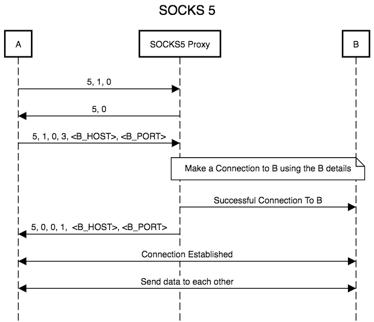

go-socks5 [](https://travis-ci.org/armon/go-socks5)
=========

Provides the `socks5` package that implements a [SOCKS5 server](http://en.wikipedia.org/wiki/SOCKS).
SOCKS (Secure Sockets) is used to route traffic between a client and server through
an intermediate proxy layer. This can be used to bypass firewalls or NATs.

Feature
=======

The package has the following features:
* "No Auth" mode
* User/Password authentication
* Support for the CONNECT command
* Rules to do granular filtering of commands
* Custom DNS resolution
* Unit tests

TODO
====

The package still needs the following:
* Support for the BIND command
* Support for the ASSOCIATE command


Example
=======

Below is a simple example of usage

```go
// Create a SOCKS5 server
conf := &socks5.Config{}
server, err := socks5.New(conf)
if err != nil {
  panic(err)
}

// Create SOCKS5 proxy on localhost port 8000
if err := server.ListenAndServe("tcp", "127.0.0.1:8000"); err != nil {
  panic(err)
}
```


源码阅读：
=======
#####文献参考：
  https://medium.com/@nimit95/socks-5-a-proxy-protocol-b741d3bec66c


[]

###握手

##### A -> PROXY
A(Client) 向SOCKS5 代理发送初始化包（ 0x05, 0x01, 0x00 ）。第一个数据包的细分是：-
第一个字节 0x05是 SOCKS 的版本，在这种情况下，它是 SOCKS 5。这对于所有 SOCKS 5 数据包来说都是通用的。在接下来的部分中不会提到这个字节。

第二个字节 0x01用于身份验证。准确地说，是客户端支持的身份验证方法的数量。这里 0x01 表示支持一种方法。

第三个字节 0x00用于身份验证方法。有身份验证方法，可变长度，每个方法支持 1 个字节。支持的认证方式编号如下：
  0x00：无认证
  0x01：GSSAPI
  0x02：用户名/密码
  0x03–0x7F：由 IANA 分配的方法
  0x80–0xFE：保留供私人使用的方法

##### PROXY -> A
SOCKS 代理发送回 A( 0x05, 0x00 )。:-
  第二个字节 0x00是代理选择的身份验证方法。在这种情况下，它是客户端提供的唯一方法，因此是这样的。随后的身份验证取决于方法。用户名和密码身份验证（方法 0x02）在RFC 1929中进行了描述。这里不需要进一步执行与身份验证相关的步骤。如果协商的方法包括出于完整性检查和/或机密性目的的封装，则必须将进一步的请求封装在方法相关的封装中。

##### A -> PROXY
A(Client) 发送请求数据包 ( 0x05, 0x01, 0x00, 0x03, <B_HOST>, <B_PORT> )。一旦方法相关的子协商完成，客户端将请求详细信息发送到 SOCKS 代理：-

第二个字节 0x01用于命令代码。它是一个字节
  0x01：建立 TCP/IP 流连接
  0x02：建立 TCP/IP 端口绑定
  0x03：关联一个UDP端口

第三字节 0x00为保留字节。它必须是 0x00 和 1 个字节。

第四字节0x03是所需HOST的地址类型和1个字节。选项如下。
  0x01：IPv4地址，后跟4字节IP
  0x03：域名，1个字节为名称长度，后跟主机名
  0x04：IPv6地址，后跟16字节IP

最后一个Byte是网络字节序中的端口号，2个字节


##### PROXY -> A
SOCKS 代理发回请求包（0x05, 0x00, 0x00, 0x01, <B_HOST>, <B_PORT>）。这是客户端对代理的请求状态：-

第二个字节 0x00是状态字段。它是一个字节。意味着请求被批准。

第三字节 0x00是保留字节。它必须是 0x00 和 1 个字节。

第四个字节 0x01是所需 HOST 的地址类型和 1 个字节。在 CONNECT 的情况下，后面是所需主机的绑定 IP 地址，以向客户端提供 DNS 解析的详细信息。

最后一个字节是网络字节序中的端口号，2字节


##### OK
在此之后，连接发生，来自客户端 A 的所有数据都被传输到客户端 B，反之亦然。通过这种方式，SOCKS 代理作为通用框架代理工作，并以其安全特性处理大多数 PROTOCOL。
